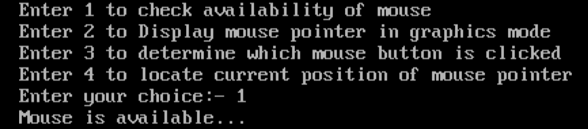
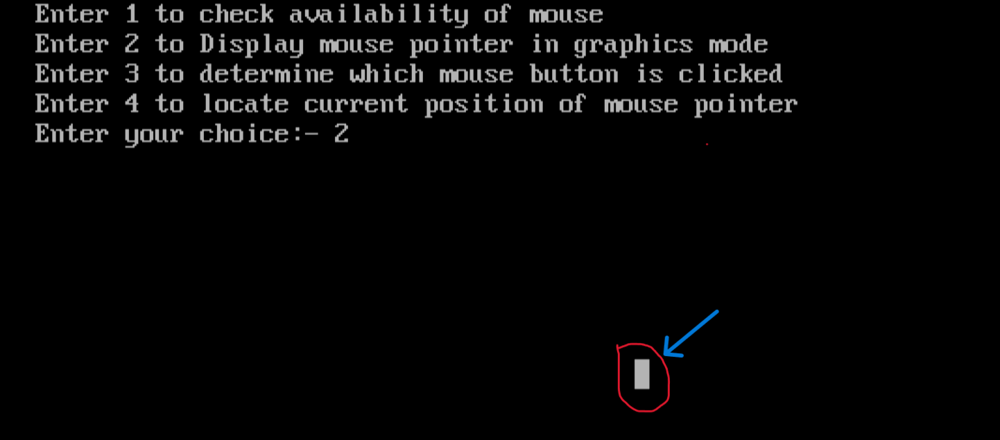
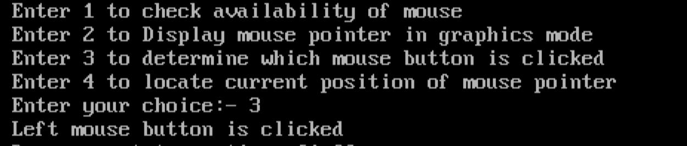
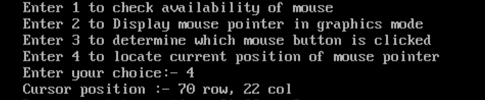

# Implementing-mouse-operations-in-c
This repository contains code for implementing various operations with mouse

##### Problem Statement

# Here are outputs

### Case 1 - Check whether mouse is available or not

 
 

### Case 2 - To display mouse pointer in graphics mode

 
 

### Case 3 - To check which mouse button is clicked

 
 

### Case 4 - To find the position of cursor

 
 
